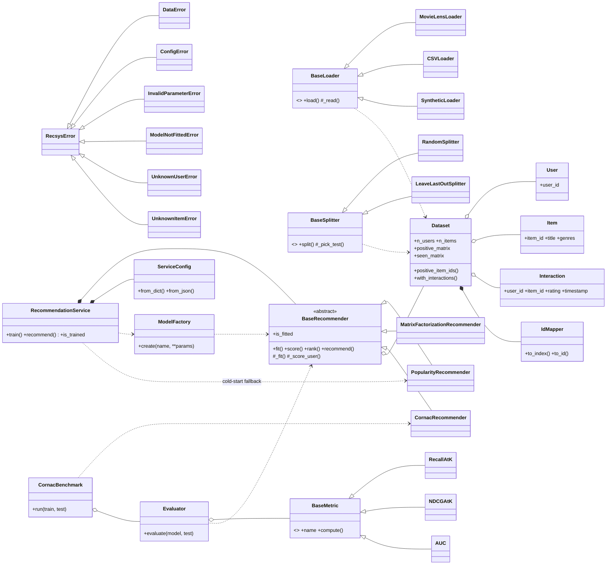
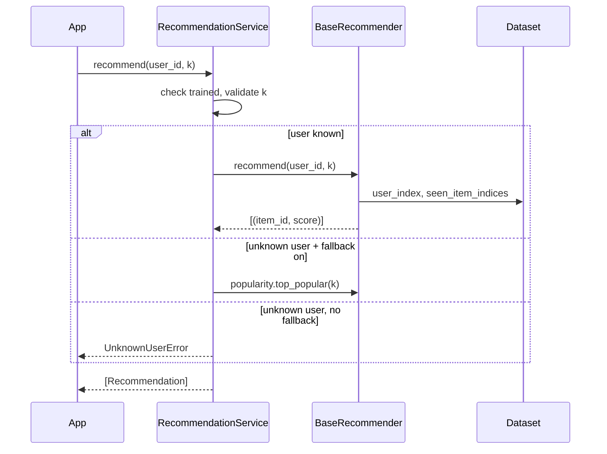

# Class diagram (Mermaid — renders on GitHub)

```mermaid
classDiagram
    direction LR
    class RecsysError
    RecsysError <|-- DataError
    RecsysError <|-- ConfigError
    RecsysError <|-- InvalidParameterError
    RecsysError <|-- ModelNotFittedError
    RecsysError <|-- UnknownUserError
    RecsysError <|-- UnknownItemError

    class User { +user_id }
    class Item { +item_id +title +genres }
    class Interaction { +user_id +item_id +rating +timestamp }
    class IdMapper { +to_index() +to_id() }
    class Dataset {
        +n_users +n_items
        +positive_matrix
        +seen_matrix
        +positive_item_ids()
        +with_interactions()
    }
    Dataset o-- User
    Dataset o-- Item
    Dataset o-- Interaction
    Dataset *-- IdMapper

    class BaseLoader { <<abstract>> +load() #_read() }
    BaseLoader <|-- MovieLensLoader
    BaseLoader <|-- CSVLoader
    BaseLoader <|-- SyntheticLoader
    BaseLoader ..> Dataset

    class BaseSplitter { <<abstract>> +split() #_pick_test() }
    BaseSplitter <|-- RandomSplitter
    BaseSplitter <|-- LeaveLastOutSplitter
    BaseSplitter ..> Dataset

    class BaseRecommender {
        <<abstract>>
        +fit() +score() +rank() +recommend()
        +is_fitted
        #_fit() #_score_user()
    }
    BaseRecommender <|-- PopularityRecommender
    BaseRecommender <|-- MatrixFactorizationRecommender
    BaseRecommender <|-- CornacRecommender
    BaseRecommender o-- Dataset
    class ModelFactory { +create(name, **params) }
    ModelFactory ..> BaseRecommender

    class BaseMetric { <<abstract>> +name +compute() }
    BaseMetric <|-- RecallAtK
    BaseMetric <|-- NDCGAtK
    BaseMetric <|-- AUC
    class Evaluator { +evaluate(model, test) }
    Evaluator o-- BaseMetric
    Evaluator ..> BaseRecommender

    class ServiceConfig { +from_dict() +from_json() }
    class RecommendationService { +train() +recommend() +is_trained }
    RecommendationService *-- BaseRecommender
    RecommendationService *-- ServiceConfig
    RecommendationService ..> ModelFactory
    RecommendationService ..> PopularityRecommender : cold-start fallback

    class CornacBenchmark { +run(train, test) }
    CornacBenchmark ..> CornacRecommender
    CornacBenchmark o-- Evaluator
```

## Sequence: `service.recommend(user, k)`

```mermaid
sequenceDiagram
    participant App
    participant S as RecommendationService
    participant M as BaseRecommender
    participant D as Dataset
    App->>S: recommend(user_id, k)
    S->>S: check trained, validate k
    alt user known
        S->>M: recommend(user_id, k)
        M->>D: user_index, seen_item_indices
        M-->>S: [(item_id, score)]
    else unknown user + fallback on
        S->>M: popularity.top_popular(k)
    else unknown user, no fallback
        S-->>App: UnknownUserError
    end
    S-->>App: [Recommendation]
```
